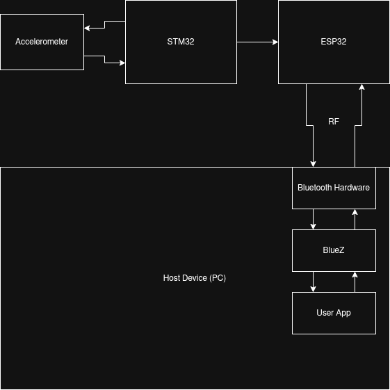

# Magic Wand

## Hardware

### ESP-WROOM-32
voltage: 3-5V
[datasheet]()

### STM32F446RE
voltage: 3-5V
[datasheet]()

### MPU-6500 Accelerometer
voltage: 3-5V
[datasheet](https://www.alldatasheet.com/html-pdf/1140874/TDK/MPU-6500/1463/21/MPU-6500.html)

## Block Diagram

  

## Host side application

Python Tui application that communicates with the ESP32 over BLE and draws the
magic wand's movements to the screen.

Run will `make app` or `python3.14 app/app.py`

### Dependencies

* Python 3.14
  * bleak
  * shutil
  * curses
* BlueZ

## ESP32

### Dependencies

* ArduinoIDE
* esp32 board package by Espressif Systems
* ESP32 BLE Arduino

### Compilation

Use Arduino IDE with the ESP32 Dev Module from Espressif to compile and flash.

## STM32

### Dependencies

### Compilation

## BlueTooth Protocol
